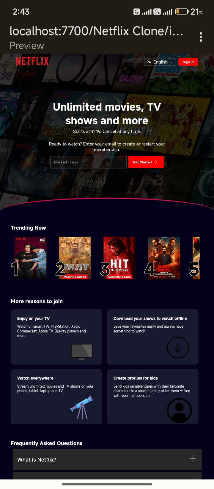

---

# 🎬 Netflix Clone (Frontend)

A responsive frontend Netflix homepage clone built using HTML and CSS for learning and portfolio demonstration.

---

## 📚 Table of Contents
- [Features](#-features)
- [Screenshot](#-screenshot)
- [Tech Stack](#-tech-stack)
- [How to Use](#-how-to-use)
- [Folder Structure](#-folder-structure)
- [License](#-license)
- [Author](#-author)

---

## 🚀 Features
- Clean Netflix-like design
- Responsive layout (mobile to desktop)
- Movie thumbnails, banners, nav bar
- Good UI spacing, color, and layout control

---

## 🖼️ Screenshot

---

## ⚙️ Tech Stack
- HTML5
- CSS3

---

## ▶️ How to Use

1. Download or clone the repository.
2. Open `index.html` in any browser.
3. Adjust window to see responsive design.

---

## 📂 Folder Structure

netflix-clone/
├── index.html
├── style.css
├── README.md
├── LICENSE
├── screenshot.jpg

---

## 📄 License

Licensed under the MIT License.
See [LICENSE](LICENSE) file for full text.

---

## 🙋‍♂️ Author

**Raunak Raj**
- Class 10 Student | From India 🇮🇳
- Aspiring Freelancer | Web Developer | Python Programmer
- [Portfolio Website](https://raunak-raj-2025.github.io)
